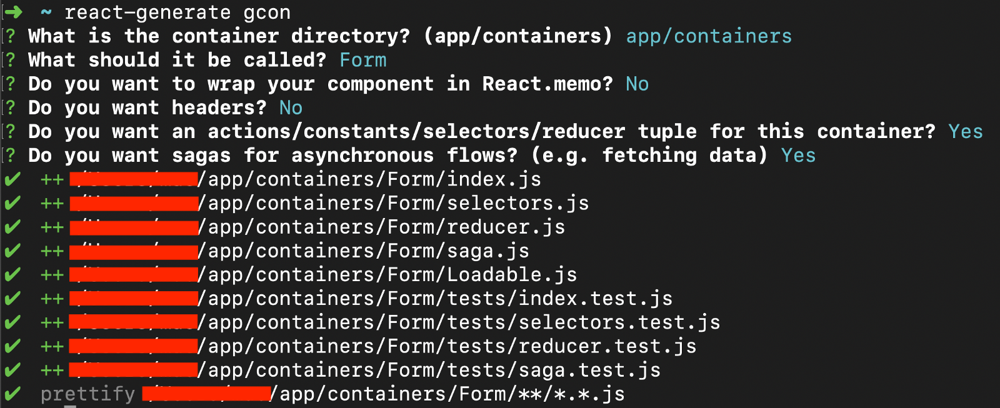
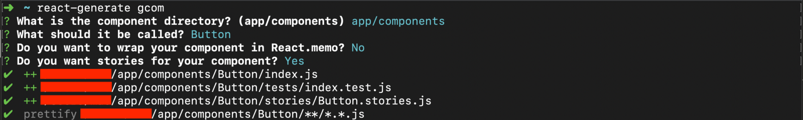

# react-floki


## Generate new components, containers and tests for existing and new react components

## Installation

### Globally install react-generate

`npm install -g react-floki`

**OR**

`yarn global add react-floki`

## Examples of generated files

- [Container](generated-files/container)
- [Component](generated-files/component)
- [Loadable](generated-files/loadable)
- [InjectSaga utils](generated-files/inject-saga)
- [Test-util](generated-files/test-util)

## Generating containers with tests and stories



## Generate components with tests and stories



## Documentation

### Help

To get a list of commands and usage hints use

```
react-generate --help
```

### Creating a new React Application

```
react-generate init movie-rating
```

### Generating tests for all existing components and containers

**Creating a test for a container or component:** `react-generate gt`

**Creating a test for an existing component:** `react-generate gtcom`

**Creating a test for an existing container:** `react-generate gtcon`

### Forcefully generating tests for all existing components and containers

**Forcefully creating a test for a container or component:** `react-generate gtf`

**Forcefully creating a test for an existing component:** `react-generate gtcomf`

**Forcefully creating a test for an existing container:** `react-generate gtconf`

### Generating components and containers

**Creating a container or component:** `react-generate g`

**Creating a component:** `react-generate gcom`

**Creating a container:** `react-generate gcon`

### Forcefully generating components and containers

**Forcefully creating a container or component:** `react-generate gf`

**Forcefully creating a component:** `react-generate gcomf`

**Forcefully creating a container:** `react-generate gconf`

### Generating tests for all existing components and containers

**Generate test for all components in directory:** `react-generate --all component <path-to-components>`

**Generate test for all containers in directory:** `react-generate --all containers <path-to-containers>`

### Generating a testUtils file with some utility functions for tests

**Generate a test util file:** `react-generate gtutil`

### Generating a utility for a loadable file using React 16 lazy and Suspense

**Generating a utility for a loadable file :** `react-generate gloadable`

# Advanced

## Example Usages

**Creating a test by specifying type, path and name:** `react-generate gt component src/app Button`

**Creating a test for an existing component by specifying path and name:** `react-generate gtcom src/app Button`

**Creating a test for an existing container by specifying path and name:** `react-generate gtcon src/app HomePage`

**Creating a component/container by specifying type, path and name:** `react-generate g component src/app Button`

**Creating a component by specifying path and name:** `react-generate gcom src/app Button`

**Creating a container by specifying path and name:** `react-generate gcon src/app HomePage`

**Generate test for all components in directory:** `react-generate --all component src/app/components`

**Generate test for all containers in directory:** `react-generate --all container src/app/containers`

# Projects using it

- [React Template](https://github.com/wednesday-solutions/react-template)
